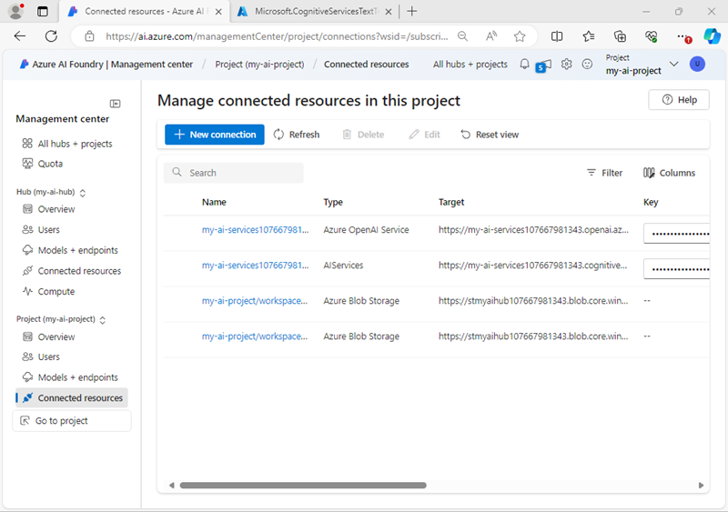

---
lab:
  title: Prepararsi per un progetto di sviluppo di intelligenza artificiale
  description: Informazioni su come organizzare le risorse cloud in hub e progetti in modo da garantire agli sviluppatori una creazione di soluzioni di intelligenza artificiale di successo.
---

# Prepararsi per un progetto di sviluppo di intelligenza artificiale

In questo esercizio si usa il Portale Fonderia Azure AI per creare un hub e un progetto, pronti per permettere a un team di sviluppatori di creare una soluzione di intelligenza artificiale.

Questo esercizio richiede circa **30** minuti.

> **Nota**: alcune delle tecnologie usate in questo esercizio sono in anteprima o in fase di sviluppo attivo. È possibile che si verifichino alcuni comportamenti, avvisi o errori imprevisti.

## Aprire il portale di Azure AI Foundry

Per iniziare, accedere al Portale Fonderia Azure AI.

1. In un Web browser, aprire il [Portale Fonderia Azure AI](https://ai.azure.com) su `https://ai.azure.com` e accedere usando le credenziali di Azure. Chiudere tutti i riquadri dei suggerimenti o di avvio rapido che vengono aperti al primo accesso e, se necessario, usare il logo **Fonderia Azure AI** in alto a sinistra per passare alla home page, simile all'immagine seguente (chiudere il riquadro **Aiuto** nel caso sia aperto):

    

1. Esaminare le informazioni nella home page.

## Creare un hub e un progetto

Un *hub* di Azure per intelligenza artificiale offre un'area di lavoro collaborativa in cui è possibile definire uno o più *progetti*. Verrà creato un progetto e un hub di Azure AI e verranno esaminate le risorse di Azure create per supportarli.

1. Nella home page, selezionare **+ Crea progetto**.
1. Nella procedura guidata **Crea un progetto**, immettere un nome appropriato per il progetto. Se viene suggerito un hub esistente, selezionare l'opzione per crearne uno nuovo. Successivamente, esaminare le risorse Azure che verranno create automaticamente per supportare l'hub e il progetto.
1. Selezionare **Personalizza** e specificare le impostazioni seguenti per l'hub:
    - **Nome hub**: *un nome valido per l'hub*
    - **Sottoscrizione**: *la sottoscrizione di Azure usata*
    - **Gruppo di risorse**: *creare o selezionare un gruppo di risorse*
    - **Posizione**: selezionare **Informazioni su come scegliere** e quindi selezionare **gpt-4o** nella finestra Helper posizione e usare l'area consigliata\*
    - **Connettere Servizi di Azure AI o Azure OpenAI**: *Creare una nuova risorsa di Servizi di AI*
    - **Connettere Azure AI Search**: ignorare la connessione

    > \* Le risorse Azure OpenAI sono limitate da quote di modelli regionali. In caso di superamento di un limite di quota più avanti nell'esercizio, potrebbe essere necessario creare un'altra risorsa in un'area diversa.

1. Selezionare **Avanti** per esaminare la configurazione. Quindi selezionare **Crea** e attendere il completamento del processo.
1. Quando viene creato il progetto, chiudere tutti i suggerimenti visualizzati e rivedere la pagina del progetto nel portale Fonderia di Azure AI, che dovrebbe essere simile all'immagine seguente:

    

1. Nella parte inferiore del riquadro di spostamento a sinistra selezionare **Centro di gestione**. Il centro di gestione consente di configurare le impostazioni sia a livello di *hub* che di *progetto*, entrambi visualizzati nel riquadro di spostamento.

    

    Si noti che nel riquadro di spostamento è possibile visualizzare e gestire asset a livello di hub e di progetto nelle pagine seguenti:

    - Panoramica
    - Utenti
    - Modelli ed endpoint
    - Risorse connesse
    - Calcolo (*solo a livello di hub*)

    > **Nota**: a seconda delle autorizzazioni assegnate al proprio Entra ID nel tenant di Azure, potrebbe non essere possibile gestire le risorse a livello di hub.

1. Nel riquadro di spostamento, nella sezione relativa all'hub, selezionare la pagina **Panoramica** per visualizzare i dettagli dell'hub. 
1. Nel riquadro **Proprietà hub** selezionare il collegamento al gruppo di risorse associato all'hub per aprire una nuova scheda del browser e passare al portale di Azure. Se richiesto, accedere con le proprie credenziali di Azure.
1. Visualizzare il gruppo di risorse nel portale di Azure per visualizzare le risorse di Azure create per supportare l'hub e il progetto.

    

    Si noti che le risorse sono state create nell'area selezionata durante la creazione dell'hub.

## Aggiungere una risorsa connessa

Si supponga che il progetto debba accedere a una seconda risorsa di **Servizi di Azure AI** in un'area diversa.

1. Nel portale di Azure, nella pagina del gruppo di risorse, selezionare **+ Crea** e cercare `Azure AI Services`. Nei risultati selezionare la risorsa multiservizio di **Servizi di Azure AI**, come illustrato nell'immagine seguente:

    

1. Creare una nuova risorsa di **Servizi di Azure AI** con le impostazioni seguenti:
    - **Sottoscrizione**: *la sottoscrizione di Azure usata*
    - **Gruppo di risorse**: *il gruppo di risorse contenente la risorsa di Fonderia Azure AI esistente*
    - **Area**: *selezionare una qualsiasi area disponibile diversa da quella contenente le risorse esistenti*
    - **Nome**: *un nome appropriato per la seconda risorsa di Servizi di Azure AI*
    - **Piano tariffario**: Standard S0.
1. Attendere che la risorsa dei servizi d'intelligenza artificiale venga creata.
1. Tornare alla scheda del browser del Portale Fonderia Azure AI e nella vista **Centro di gestione**, nella sezione relativa al *<u>progetto</u>* nel riquadro di spostamento, visualizzare la pagina **Risorse connesse**. Vengono elencate le risorse connesse esistenti nel progetto.

    

1. Selezionare **+ Nuova connessione** e selezionare il tipo di risorsa di **Servizi di Azure AI**. Esplorare quindi le risorse disponibili per trovare la risorsa di Servizi AI creata nel portale di Azure e usare il relativo pulsante **Aggiungi connessione** per aggiungerla al progetto.

    

1. Quando la nuova risorsa è connessa, chiudere la finestra di dialogo **Connetti risorse di Servizi di Azure AI** e verificare che siano elencate le nuove risorse connesse per Servizi di Azure AI e Servizio OpenAI di Azure.

## Esplorare i Servizi di intelligenza artificiale

Il progetto di Fonderia Azure AI ha accesso ai Servizi di Azure AI. Ora si proverà a farlo nel portale.

1. Nel riquadro di spostamento della pagina Centro di gestione, sotto il progetto, selezionare **Vai al progetto**.
1. Nel riquadro di spostamento del progetto, selezionare **Servizi di intelligenza artificiale** e selezionare il riquadro **Lingua e traduttore**.

    

1. Nella sezione **Esplora funzionalità di lingua** visualizzare la scheda **Traduzione** e selezionare **Traduzione testo**.

    

1. Nella pagina **Traduzione testo**, nella sezione **Prova**, visualizzare la scheda **Prova con**.
1. Selezionare una delle risorse di Servizi di Azure AI e quindi provare a tradurre un testo (ad esempio, `Hello world`) da una lingua a un'altra.

    

## Implementare e testare un modello di IA generativa

Il progetto contiene anche le risorse connesse per Azure OpenAI, che consente di usare modelli linguistici di Azure OpenAI per implementare soluzioni di IA generativa. È anche possibile trovare e usare modelli di IA generativa di altri fornitori nel catalogo dei modelli.

1. Nel riquadro a sinistra del progetto, nella sezione **Risorse personali** selezionare la pagina **Modelli + endpoint**.
1. Nella scheda **Distribuzioni del modello** della pagina **Modelli + endpoint**, nel menu **+ Distribuisci modello** selezionare **Distribuisci modello di base**.
1. Cercare il modello **gpt-4o** nell'elenco e quindi selezionarlo e confermarlo.
1. Distribuire il modello con le impostazioni seguenti selezionando **Personalizza** nei dettagli della distribuzione:
    - **Nome distribuzione**: *nome univoco per la distribuzione del modello*
    - **Tipo di distribuzione**: standard globale
    - **Aggiornamento automatico della versione**: abilitato
    - **Versione del modello**: *selezionare la versione più recente disponibile*
    - **Risorsa di intelligenza artificiale connessa**: *selezionare la connessione alla risorsa Azure OpenAI*
    - **Token al limite di velocità al minuto (migliaia)**: 50.000 *(o il valore massimo disponibile nella sottoscrizione se inferiore a 50.000)*
    - **Filtro contenuto**: predefinitoV2

    > **Nota**: la riduzione del TPM consente di evitare l'eccessivo utilizzo della quota disponibile nella sottoscrizione in uso. 50.000 TPM dovrebbero essere sufficienti per i dati usati in questo esercizio. Se la quota disponibile è inferiore a questa, sarà possibile completare l'esercizio, ma potrebbero verificarsi errori se viene superato il limite di velocità.

1. Attendere il completamento della distribuzione.

1. Dopo aver distribuito il modello, nella pagina di panoramica della distribuzione selezionare **Apri nel playground**.
1. Nella pagina **playground della chat** assicurarsi che la distribuzione del modello sia selezionata nella sezione **Distribuzione**.
1. Nel riquadro **Imposta**, nella casella **Fornisci istruzioni e contesto al modello**, immettere le istruzioni seguenti:

    ```
    You are a history teacher who can answer questions about past events all around the world.
    ```

1. Applicare le modifiche per aggiornare il messaggio di sistema.
1. Nella finestra della chat immettere una query, ad esempio `What are the key events in the history of Scotland?`, e visualizzare la risposta:

    

## Riepilogo

In questo esercizio è stata esaminata Fonderia Azure AI ed è stato illustrato come creare e gestire hub e progetti, aggiungere risorse connesse ed esplorare i modelli di Servizi di Azure AI e di Azure OpenAI nel Portale Fonderia Azure AI.

## Eseguire la pulizia

Al termine dell'esplorazione del portale Azure AI Foundry, è necessario eliminare le risorse create in questo esercizio per evitare di incorrere in costi di Azure non necessari.

1. Tornare alla scheda del browser che contiene il portale di Azure (o riaprire il [portale di Azure](https://portal.azure.com) su `https://portal.azure.com` in una nuova scheda del browser) e visualizzare il contenuto del gruppo di risorse in cui sono state distribuite le risorse usate in questo esercizio.
1. Sulla barra degli strumenti selezionare **Elimina gruppo di risorse**.
1. Immettere il nome del gruppo di risorse e confermarne l'eliminazione.
