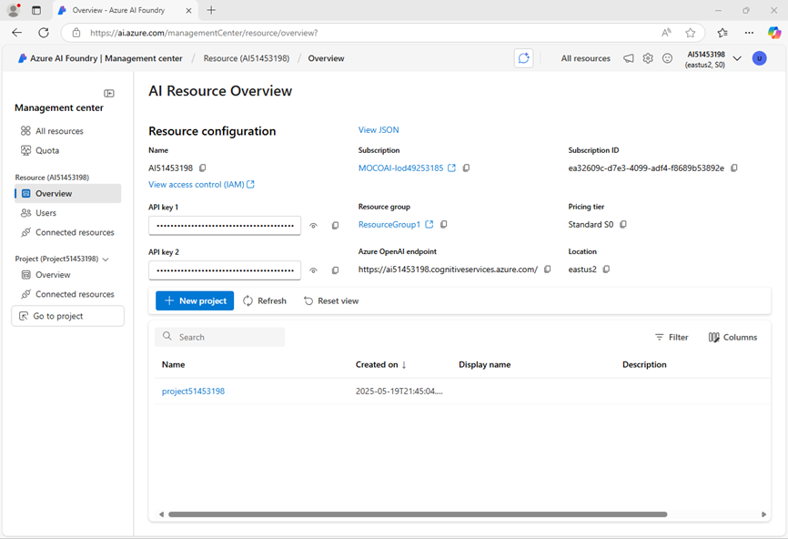

---
lab:
  title: Prepararsi per un progetto di sviluppo di intelligenza artificiale
  description: Informazioni su come organizzare le risorse cloud in hub e progetti in modo da garantire agli sviluppatori una creazione di soluzioni di intelligenza artificiale di successo.
---

# Prepararsi per un progetto di sviluppo di intelligenza artificiale

In questo esercizio, viene utilizzato Portale Fonderia Azure AI per creare un progetto, pronto a compilare una soluzione di intelligenza artificiale.

Questo esercizio richiede circa **30** minuti.

> **Nota**: alcune delle tecnologie usate in questo esercizio sono in anteprima o in fase di sviluppo attivo. È possibile che si verifichino alcuni comportamenti, avvisi o errori imprevisti.

## Aprire il portale di Azure AI Foundry

Per iniziare, accedere al Portale Fonderia Azure AI.

1. In un Web browser, aprire il [Portale Fonderia Azure AI](https://ai.azure.com) su `https://ai.azure.com` e accedere usando le credenziali di Azure. Chiudere tutti i riquadri dei suggerimenti o di avvio rapido che vengono aperti al primo accesso e, se necessario, usare il logo **Fonderia Azure AI** in alto a sinistra per passare alla home page, simile all'immagine seguente (chiudere il riquadro **Aiuto** nel caso sia aperto):

    

1. Esaminare le informazioni nella home page.

## Creare un progetto

Un *progetto* Azure AI offre un'area di lavoro collaborativa per lo sviluppo dell'intelligenza artificiale. Per iniziare, scegliere un modello da usare e creare un progetto in cui usarlo.

> **Nota**: i progetti Fonderia AI possono essere basati su una risorsa *Fonderia Azure AI* , che fornisce l'accesso ai modelli di intelligenza artificiale (tra cui Azure OpenAI), a Servizi di Azure AI e ad altre risorse per lo sviluppo di agenti di intelligenza artificiale e soluzioni di chat. In alternativa, i progetti possono essere basati sulle risorse *Hub IA*, che includono connessioni alle risorse di Azure per l'archiviazione sicura, il calcolo e gli strumenti specializzati. I progetti basati su Fonderia Azure AI sono ideali per gli sviluppatori che vogliono gestire le risorse per lo sviluppo di agenti IA o di app di chat. I progetti basati su Hub IA sono più adatti per i team di sviluppo aziendale che lavorano su soluzioni di intelligenza artificiale complesse.

1. Nella home page, nella sezione **Esplora modelli e funzionalità**, cercare il modello `gpt-4o`, che verrà usato nel progetto.
1. Nei risultati della ricerca, selezionare il modello **gpt-4o** per visualizzarne i dettagli e quindi nella parte superiore della pagina selezionare **Usa questo modello**.
1. Quando viene richiesto di creare un progetto, immettere un nome valido per il progetto ed espandere **Opzioni avanzate**.
1. Selezionare **Personalizza** e specificare le impostazioni seguenti per il progetto:
    - **Risorsa di Fonderia Azure AI**: *nome valido per la risorsa di Fonderia Azure AI*
    - **Sottoscrizione**: *la sottoscrizione di Azure usata*
    - **Gruppo di risorse**: *creare o selezionare un gruppo di risorse*
    - **Area geografica**: *selezionare qualsiasi **località supportata per i servizi di intelligenza artificiale**\*

    > \* Alcune risorse Azure AI sono limitate da quote di modelli regionali. In caso di superamento di un limite di quota più avanti nell'esercizio, potrebbe essere necessario creare un'altra risorsa in un'area diversa.

1. Selezionare **Crea** e attendere la creazione del progetto, inclusa la distribuzione del modello gpt-4 selezionato.
1. Quando viene creato il progetto, il playground della chat verrà aperto automaticamente in modo da poter testare il modello:

    

1. Nel riquadro di spostamento a sinistra, selezionare **Panoramica** per visualizzare la pagina principale del progetto, che avrà questo aspetto:

    > **Nota**: se viene visualizzato un errore *autorizzazioni insufficienti*, usare il pulsante **Correggi** per risolverlo.

    

1. Nella parte inferiore del riquadro di spostamento a sinistra selezionare **Centro di gestione**. Il centro di gestione consente di configurare le impostazioni sia a livello di *risorsa* sia di *progetto*, entrambi visualizzati nel riquadro di spostamento.

    

    Il livello di *risorsa* è correlato alla risorsa **Fonderia Azure AI** creata per supportare il progetto. Questa risorsa include le connessioni ai Servizi di Azure AI e ai modelli di Fonderia Azure AI, e offre una posizione centrale per gestire l'accesso degli utenti ai progetti di sviluppo di intelligenza artificiale.

    Il livello di *progetto* è correlato al singolo progetto, in cui è possibile aggiungere e gestire risorse specifiche del progetto.

1. Nel riquadro di spostamento, nella sezione della risorsa Fonderia Azure AI, selezionare la pagina **Panoramica** per visualizzare i dettagli.
1. Selezionare il collegamento al **Gruppo di risorse** associato alla risorsa per aprire una nuova scheda del browser e passare al portale di Azure. Se richiesto, accedere con le proprie credenziali di Azure.
1. Visualizzare il gruppo di risorse nel portale di Azure per visualizzare le risorse di Azure create per supportare la risorsa Fonderia Azure AI e il progetto.

    

    Notare che le risorse sono state create nell'area geografica selezionata durante la creazione del progetto.

1. Chiudere la scheda portale di Azure e tornare al portale Fonderia Azure AI.

## Rivedere i collegamenti del progetto.

Il progetto Fonderia Azure AI e la relativa risorsa a cui appartiene includono connessioni alle risorse che è possibile usare nelle applicazioni di intelligenza artificiale.

1. Nel riquadro di spostamento della pagina Centro di gestione, sotto il progetto, selezionare **Vai alla risorsa**.
1. Nella pagina **Panoramica** del progetto, visualizzare la sezione **Endpoint e chiavi**, che contiene endpoint e chiavi di autorizzazione da poter usare nel codice dell'applicazione per accedere a:
    - Il progetto Fonderia Azure AI e tutti i modelli distribuiti in esso.
    - Azure OpenAI nei modelli Fonderia Azure AI.
    - Servizi di Azure AI

## Testare il modello di IA generativa

Dopo aver appreso qualcosa sulla configurazione del progetto Fonderia Azure AI, è possibile tornare al playground della chat per esplorare il modello distribuito.

1. Selezionare **Playground** nel riquadro di spostamento a sinistra del progetto 
1. Aprire il **playground della chat** e assicurarsi che la distribuzione del modello **gpt-4o** sia selezionata nella sezione **Distribuzione**.
1. Nel riquadro **Imposta**, nella casella **Fornisci istruzioni e contesto al modello**, immettere le istruzioni seguenti:

    ```
   You are a history teacher who can answer questions about past events all around the world.
    ```

1. Applicare le modifiche per aggiornare il messaggio di sistema.
1. Nella finestra della chat immettere una query, ad esempio `What are the key events in the history of Scotland?`, e visualizzare la risposta:

    

## Riepilogo

In questo esercizio, sono stati esaminati Fonderia Azure AI e si è visto come creare e gestire i progetti e le relative risorse.

## Eseguire la pulizia

Al termine dell'esplorazione del portale Azure AI Foundry, è necessario eliminare le risorse create in questo esercizio per evitare di incorrere in costi di Azure non necessari.

1. Nel [portale Azure](https://portal.azure.com) in `https://portal.azure.com`, visualizzare il contenuto del gruppo di risorse in cui sono state distribuite le risorse usate in questo esercizio.
1. Sulla barra degli strumenti selezionare **Elimina gruppo di risorse**.
1. Immettere il nome del gruppo di risorse e confermarne l'eliminazione.
