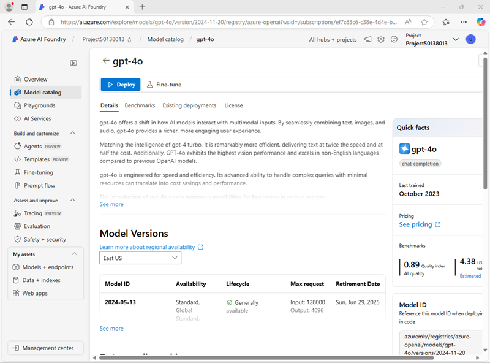

---
lab:
  title: Scegliere e distribuire un modello linguistico
  description: Le applicazioni di IA generativa si basano su uno o più modelli linguistici. Informazioni su come trovare e selezionare i modelli appropriati per il progetto di IA generativa.
---

# Scegliere e distribuire un modello linguistico

Il catalogo dei modelli in Azure AI Foundry funge da repository centrale in cui è possibile esplorare e usare un'ampia gamma di modelli, semplificando la creazione dello scenario di intelligenza artificiale generativa.

In questo esercizio verrà esaminerà il catalogo dei modelli nel portale AI Azure Foundry e verranno confrontati i modelli potenziali per un'applicazione di IA generativa che consente di risolvere i problemi.

Questo esercizio richiederà circa **25** minuti.

> **Nota**: alcune delle tecnologie usate in questo esercizio sono in anteprima o in fase di sviluppo. È possibile che si verifichino alcuni comportamenti, avvisi o errori imprevisti.

## Creare un progetto e un hub di Azure per intelligenza artificiale

Un hub di Intelligenza artificiale di Azure offre un'area di lavoro collaborativa in cui è possibile definire uno o più *progetti*. Creare un progetto un hub di Azure per intelligenza artificiale.

1. In un Web browser, aprire il [Portale Fonderia Azure AI](https://ai.azure.com) su `https://ai.azure.com` e accedere usando le credenziali di Azure. Chiudere tutti i riquadri dei suggerimenti o di avvio rapido che vengono aperti al primo accesso e, se necessario, usare il logo **Fonderia Azure AI** in alto a sinistra per passare alla home page, simile all'immagine seguente (chiudere il riquadro **Aiuto** nel caso sia aperto):

    

1. Nella home page, selezionare **+ Crea progetto**.
1. Nella procedura guidata **Crea un progetto**, immettere un nome appropriato per il progetto. Se viene suggerito un hub esistente, selezionare l'opzione per crearne uno nuovo. Successivamente, esaminare le risorse Azure che verranno create automaticamente per supportare l'hub e il progetto.
1. Selezionare **Personalizza** e specificare le impostazioni seguenti per l'hub:
    - **Nome hub**: *un nome valido per l'hub*
    - **Sottoscrizione**: *la sottoscrizione di Azure usata*
    - **Gruppo di risorse**: *creare o selezionare un gruppo di risorse*
    - **Posizione**: selezionare **Informazioni su come scegliere** e quindi selezionare **gpt-4o** nella finestra Helper posizione e usare l'area consigliata\*
    - **Connettere Servizi di Azure AI o Azure OpenAI**: *Creare una nuova risorsa di Servizi di AI*
    - **Connettere Azure AI Search**: ignorare la connessione

    > \* Le risorse Azure OpenAI sono limitate da quote di modelli regionali. In caso di superamento di un limite di quota più avanti nell'esercizio, potrebbe essere necessario creare un'altra risorsa in un'area diversa.

1. Selezionare **Avanti** per esaminare la configurazione. Quindi selezionare **Crea** e attendere il completamento del processo.
1. Quando viene creato il progetto, chiudere tutti i suggerimenti visualizzati e rivedere la pagina del progetto nel portale Fonderia di Azure AI, che dovrebbe essere simile all'immagine seguente:

    

## Configurare la distribuzione del servizio Inferenza Azure AI

Sono disponibili più opzioni per la distribuzione di modelli nel Portale Fonderia Azure AI. In questo esercizio si userà l'opzione di distribuzione dell'**inferenza del modello di Azure per intelligenza artificiale**, che supporta sia i modelli *Azure OpenAI* che quelli *Modello come servizio* del catalogo modelli di Fonderia Azure AI. Poiché tutti i modelli vengono distribuiti in un endpoint comune ospitato dalla risorsa di Servizi di Azure AI, è facile passare da un modello all'altro durante il test per confrontare il comportamento e le prestazioni.

1. Nella barra degli strumenti nella parte superiore destra della pagina del progetto Fonderia Azure AI, usare l'icona **Funzionalità di anteprima** (**&#9215;**) per visualizzare le funzionalità di anteprima.
1. Verificare che la funzionalità **Distribuisci modelli nel servizio di inferenza del modello di Azure per intelligenza artificiale** sia abilitata. Chiudere quindi il riquadro **Funzionalità di anteprima**.

## Rivedere i benchmark e i dettagli del modello

Per facilitare la scelta di un modello, è possibile esplorare i benchmark e le descrizion dei modelli per determinare quale sia il più adatto alle proprie esigenze.

1. Nel portale del progetto Fonderia Azure AI, selezionare **Catalogo modelli** nel riquadro di spostamento a sinistra.
1. Nella home page del catalogo modelli, cercare `gpt-4o` per trovare il modello di completamento della chat **gpt-4o**.

    

1. Selezionare il modello **gpt-4o** e visualizzarne i dettagli. Leggere la descrizione ed esaminare le altre informazioni disponibili nella pagina.

    

1. Nella pagina **gpt-4o**, visualizzare la scheda **Benchmark** per vedere in che modo il modello si confronta con altri modelli usati in scenari simili, in base ad alcuni indicatori delle prestazioni standard.

    

1. Usare la freccia indietro (**&larr;**) accanto al titolo della pagina **gpt-4o** per tornare alla home page del catalogo dei modelli.
1. Nel catalogo dei modelli cercare `Phi-3.5-mini-instruct` e visualizzare i dettagli e i benchmark per il modello **Phi-3.5-mini-instruct**.

## Confrontare i modelli

Sono stati esaminati due modelli diversi, entrambi utilizzabili per implementare un'applicazione di chat di IA generativa. Ora si confrontano visivamente le metriche per questi due modelli.

1. Tornare alla home page del **Catalogo modelli**.
1. Selezionare **Confronta modelli**. Viene visualizzato un grafico visivo per il confronto tra modelli con una selezione di modelli comuni.

    

1. Nel riquadro **Modelli da confrontare** a sinistra si noti che è possibile selezionare le attività più comuni, ad esempio la *risposta alla domanda*, per selezionare automaticamente i modelli di uso comune per attività specifiche.
1. Usare l'icona **Cancella tutti i modelli** (&#128465;) per rimuovere tutti i modelli pre-selezionati.
1. Usare il pulsante **+ Modello da confrontare** per aggiungere il modello **GPT-4o** all'elenco. Usare quindi lo stesso pulsante per aggiungere il modello **Phi-3.5-mini-instruct** all'elenco.
1. Esaminare il grafico, che confronta i modelli in base all'**indice di qualità** (un punteggio standardizzato che indica la qualità del modello) e al **costo**. È possibile visualizzare i valori specifici per un modello tenendo il mouse sul punto che lo rappresenta nel grafico.

    

1. Nel menu a discesa **Asse X**, in **Qualità**, selezionare le metriche seguenti e osservare ogni grafico risultante prima di passare al successivo:
    - Precisione
    - Coerenza
    - Scorrevolezza
    - Pertinenza

## Distribuire i modelli

Ora che sono state esaminate le opzioni tramite benchmark del modello, è possibile distribuire i modelli linguistici. È possibile esplorare il catalogo dei modelli e distribuire da lì oppure distribuire un modello tramite la pagina **Distribuzioni**. Esaminiamo ora entrambe le opzioni.

### Distribuire un modello dal *Catalogo modelli*

Iniziamo distribuendo un modello dal catalogo dei modelli. È possibile preferire questa opzione quando si vogliono esaminare più modelli disponibili.

1. Tornare alla home page del **Catalogo modelli**.
1. Cercare e selezionare il modello `gpt-4o` esattamente come in precedenza.
1. Nella pagina **GPT-4o** selezionare **Distribuisci** e distribuire il modello con le impostazioni seguenti selezionando **Personalizza** nei dettagli della distribuzione:
1. Distribuire il modello con le impostazioni seguenti selezionando **Personalizza** nei dettagli della distribuzione:
    - **Nome distribuzione**: *nome univoco per la distribuzione del modello*
    - **Tipo di distribuzione**: standard globale
    - **Aggiornamento automatico della versione**: abilitato
    - **Versione del modello**: *selezionare la versione più recente disponibile*
    - **Risorsa di intelligenza artificiale connessa**: *selezionare la connessione alla risorsa Azure OpenAI*
    - **Token al limite di velocità al minuto (migliaia)**: 50.000 *(o il valore massimo disponibile nella sottoscrizione se inferiore a 50.000)*
    - **Filtro contenuto**: predefinitoV2

    > **Nota**: la riduzione del TPM consente di evitare l'eccessivo utilizzo della quota disponibile nella sottoscrizione in uso. 50.000 TPM dovrebbero essere sufficienti per i dati usati in questo esercizio. Se la quota disponibile è inferiore a questa, sarà possibile completare l'esercizio, ma potrebbe essere necessario attendere e inviare di nuovo le richieste se viene superato il limite di velocità.

1. Attendere il completamento della distribuzione.

### Distribuire un modello tramite *Modelli + endpoint*

Se si conosce già esattamente il modello che si vuole distribuire, è consigliabile eseguirlo tramite **Modelli + endpoint**.

1. Nella barra di spostamento a sinistra, nella sezione **Risorse personali**, selezionare **Modelli + endpoint**.
1. Nell'elenco a discesa **+ Distribuisci modello** della scheda **Distribuzioni modelli**, selezionare **Distribuisci modello di base**. Quindi cercare `Phi-3.5-mini-instruct` e confermare la selezione.
1. Accettare la licenza del modello.
1. Distribuire un modello **Phi-3.5-mini-instruct** con le impostazioni seguenti:
    - **Nome distribuzione**: *nome univoco per la distribuzione del modello*
    - **Tipo di distribuzione**: standard globale
    - **Dettagli della distribuzione**: *usare le impostazioni predefinite*

1. Attendere il completamento della distribuzione.

## Testare i modelli nel playground della chat

Ora che sono disponibili due modelli da confrontare, di seguito viene illustrato come si comportano i modelli in un'interazione conversazionale.

### Preparativi per la chat

1. Nella barra di spostamento selezionare **Playground**. Quindi selezionare il **playground chat**.
1. Nel campo **Fornisci istruzioni e contesto al modello** del riquadro **Configurazione**, impostare il menu vocale del sistema su `You are an AI assistant that helps solve problems.`
1. Fare clic su **Applica modifiche**.

### Chattare con il modello *gpt-4o*

Nel riquadro **Configurazione**, selezionare il modello *gpt-4o*.
1. Nella finestra della chat, immettere la query seguente

    ```
    I have a fox, a chicken, and a bag of grain that I need to take over a river in a boat. I can only take one thing at a time. If I leave the chicken and the grain unattended, the chicken will eat the grain. If I leave the fox and the chicken unattended, the fox will eat the chicken. How can I get all three things across the river without anything being eaten?
    ```

1. Visualizzare la risposta. Immettere quindi la query di completamento seguente:

    ```
    Explain your reasoning.
    ```

### Chattare con il modello *Phi-3.5*

1. Nel riquadro **Configurazione** selezionare il modello *Phi-3.5*.
1. Assicurarsi che venga avviata una nuova sessione di chat prima di ripetere le stesse richieste usate in precedenza per testare il modello GPT-4.
1. Nella finestra della chat, immettere la query seguente

    ```
    I have a fox, a chicken, and a bag of grain that I need to take over a river in a boat. I can only take one thing at a time. If I leave the chicken and the grain unattended, the chicken will eat the grain. If I leave the fox and the chicken unattended, the fox will eat the chicken. How can I get all three things across the river without anything being eaten?
    ```

1. Visualizzare la risposta. Immettere quindi la query di completamento seguente:

    ```
    Explain your reasoning.
    ```

### Eseguire un ulteriore confronto

1. Provare il rompicapo seguente con entrambi i modelli, chiedendo ai modelli di spiegare il loro ragionamento (la risposta corretta è 40!):

    ```
    I have 53 socks in my drawer: 21 identical blue, 15 identical black and 17 identical red. The lights are out, and it is completely dark. How many socks must I take out to make 100 percent certain I have at least one pair of black socks?
    ```

## Riflettere sui modelli

Sono stati confrontati due modelli, che possono variare sia in termini di capacità di generare risposte appropriate sia in termini costo. In qualsiasi scenario generativo, è necessario trovare un modello con il giusto equilibrio tra l'idoneità all'attività da eseguire e il costo di utilizzo del modello in base al numero di richieste che si prevede debba gestire.

I dettagli e i benchmark forniti nel catalogo dei modelli, insieme alla possibilità di confrontare visivamente i modelli, offrono un punto di partenza utile nell'identificazione dei modelli candidati per una soluzione di IA generativa. È quindi possibile testare i modelli candidati con un'ampia gamma di richieste di sistema e utente nel playground della chat.

## Eseguire la pulizia

Al termine dell'esplorazione del portale Azure AI Foundry, è necessario eliminare le risorse create in questo esercizio per evitare di incorrere in costi di Azure non necessari.

1. Aprire il [portale di Azure](https://portal.azure.com) e visualizzare il contenuto del gruppo di risorse in cui sono state distribuite le risorse usate in questo esercizio.
1. Sulla barra degli strumenti selezionare **Elimina gruppo di risorse**.
1. Immettere il nome del gruppo di risorse e confermarne l'eliminazione.
