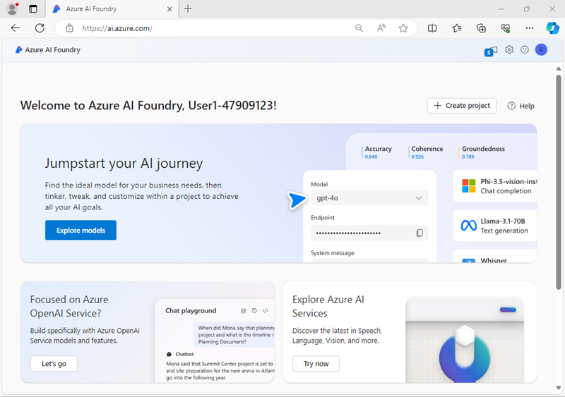

---
lab:
  title: Creare un'app di chat di IA generativa
  description: Informazioni su come usare SDK Fonderia Azure AI per compilare un'app che si connetta al progetto e che chatti con un modello linguistico.
---

# Creare un'app di chat di IA generativa

In questo esercizio si userà Python SDK per Fonderia Azure AI per creare una semplice app di chat che si connette a un progetto e chatta con un modello linguistico.

> **Nota**: Questo esercizio è basato sulla versione non definitiva del software SDK, che può essere soggetta a modifiche. Se necessario, abbiamo usato versioni specifiche dei pacchetti; che potrebbero non riflettere le versioni disponibili più recenti. È possibile che si verifichino alcuni comportamenti, avvisi o errori imprevisti.

Anche se questo esercizio è basato su Python SDK per Fonderia Azure AI, è possibile sviluppare applicazioni di chat basate su intelligenza artificiale usando più SDK specifici del linguaggio; tra cui:

- [Progetti di Azure AI per Python](https://pypi.org/project/azure-ai-projects)
- [Progetti di Azure AI per Microsoft .NET](https://www.nuget.org/packages/Azure.AI.Projects)
- [Progetti di Azure AI per JavaScript](https://www.npmjs.com/package/@azure/ai-projects)

Questo esercizio richiede circa **40** minuti.

## Distribuire un modello nel progetto Fonderia Azure AI

Per iniziare, distribuire un modello in un progetto Fonderia Azure AI.

1. In un Web browser, aprire il [Portale Fonderia Azure AI](https://ai.azure.com) su `https://ai.azure.com` e accedere usando le credenziali di Azure. Chiudere tutti i riquadri dei suggerimenti o di avvio rapido che vengono aperti al primo accesso e, se necessario, usare il logo **Fonderia Azure AI** in alto a sinistra per passare alla home page, simile all'immagine seguente (chiudere il riquadro **Aiuto** nel caso sia aperto):

    

1. Nella home page, nella sezione **Esplora modelli e funzionalità**, cercare il modello `gpt-4o`, che verrà usato nel progetto.
1. Nei risultati della ricerca, selezionare il modello **gpt-4o** per visualizzarne i dettagli e quindi nella parte superiore della pagina selezionare **Usa questo modello**.
1. Quando viene richiesto di creare un progetto, immettere un nome valido per il progetto ed espandere **Opzioni avanzate**.
1. Selezionare **Personalizza** e specificare le impostazioni seguenti per il progetto:
    - **Risorsa di Fonderia Azure AI**: *nome valido per la risorsa di Fonderia Azure AI*
    - **Sottoscrizione**: *la sottoscrizione di Azure usata*
    - **Gruppo di risorse**: *creare o selezionare un gruppo di risorse*
    - **Area**: *selezionare una delle **opzioni consigliate di Fonderia AI***\*

    > \* Alcune risorse Azure AI sono limitate da quote di modelli regionali. In caso di superamento di un limite di quota più avanti nell'esercizio, potrebbe essere necessario creare un'altra risorsa in un'area diversa.

1. Selezionare **Crea** e attendere che venga creato il progetto. Se richiesto, distribuire il modello gpt-4o usando il tipo di distribuzione **Standard globale** e personalizzare i dettagli della distribuzione per impostare un **Limite di velocità di token al minuto** di 50.000 o il valore massimo disponibile se inferiore a 50.000.

    > **Nota**: la riduzione del TPM consente di evitare l'eccessivo utilizzo della quota disponibile nella sottoscrizione in uso. 50.000 TPM dovrebbero essere sufficienti per i dati usati in questo esercizio. Se la quota disponibile è inferiore a questa, sarà possibile completare l'esercizio, ma potrebbero verificarsi errori se viene superato il limite di velocità.

1. Quando viene creato il progetto, il playground della chat verrà aperto automaticamente in modo da poter testare il modello:
1. Nel riquadro **Installazione** prendere nota del nome della distribuzione modello, che deve essere **gpt-4o**. È possibile confermarlo visualizzando la distribuzione nella pagina **Modelli ed endpoint** (è sufficiente aprire tale pagina nel riquadro di spostamento a sinistra).
1. Nel riquadro di spostamento a sinistra, selezionare **Panoramica** per visualizzare la pagina principale del progetto, che avrà questo aspetto:

    

## Creare un'applicazione client per chattare con il modello

Dopo avere distribuito un modello, è possibile usare gli SDK per Fonderia Azure AI e Azure OpenAI per sviluppare un'applicazione che chatta con tale modello.

### Preparare la configurazione dell'applicazione

1. Nel Portale Fonderia Azure AI visualizzare la pagina **Panoramica** per il progetto.
1. Nell'area **Endpoint e chiavi** assicurarsi che sia selezionata la libreria di **Fonderia Azure AI** e visualizzare l'**Endpoint del progetto di Fonderia Azure AI**. Questo endpoint verrà usato per connettersi al progetto e al modello in un'applicazione client.

    > **Nota**: È anche possibile usare l'endpoint di Azure OpenAI.

1. Aprire una nuova scheda del browser (mantenendo aperto il Portale Fonderia Azure AI nella scheda esistente). In una nuova scheda del browser, passare al [portale di Azure](https://portal.azure.com) su `https://portal.azure.com`, accedendo con le credenziali di Azure se richiesto.

    Chiudere eventuali notifiche di benvenuto per visualizzare la pagina iniziale del portale di Azure.

1. Usare il pulsante **[\>_]** a destra della barra di ricerca, nella parte superiore della pagina, per aprire una nuova sessione di Cloud Shell nel portale di Azure selezionando un ambiente ***PowerShell*** senza archiviazione nell'abbonamento.

    Cloud Shell fornisce un'interfaccia della riga di comando in un riquadro nella parte inferiore del portale di Azure. È possibile ridimensionare o ingrandire questo riquadro per ottimizzare l'esperienza d'uso.

    > **Nota**: se in precedenza è stata creata una sessione Cloud Shell che usa un ambiente *Bash*, passare a ***PowerShell***.

1. Nella barra degli strumenti di Cloud Shell scegliere **Vai alla versione classica** dal menu **Impostazioni**. Questa operazione è necessaria per usare l'editor di codice.

    **<font color="red">Verificare di passare alla versione classica di Cloud Shell prima di continuare.</font>**

1. Nel riquadro Cloud Shell immettere i comandi seguenti per clonare il repository GitHub contenente i file di codice per questo esercizio (digitare il comando o copiarlo negli Appunti e quindi fare clic con il pulsante destro del mouse nella riga di comando e incollarlo come testo normale):

    ```
   rm -r mslearn-ai-foundry -f
   git clone https://github.com/microsoftlearning/mslearn-ai-studio mslearn-ai-foundry
    ```

    > **Suggerimento**: quando vengono incollati i comandi in CloudShell, l'ouput può richiedere una grande quantità di buffer dello schermo. È possibile cancellare la schermata immettendo il `cls` comando per rendere più semplice concentrarsi su ogni attività.

1. Dopo aver clonato il repository, passare alla cartella contenente i file di codice dell'applicazione chat e visualizzarli:

    ```
   cd mslearn-ai-foundry/labfiles/chat-app/python
   ls -a -l
    ```

    La cartella contiene un file di codice, un file di configurazione per le impostazioni dell'applicazione e un file che definisce il runtime del progetto e i requisiti del pacchetto.

1. Nel riquadro della riga di comando di Cloud Shell, immettere il comando seguente per installare le librerie che verranno utilizzate:

    ```
   python -m venv labenv
   ./labenv/bin/Activate.ps1
   pip install -r requirements.txt azure-identity azure-ai-projects openai
    ```
1. Immettere il comando seguente per modificare il file di configurazione fornito:

    ```
   code .env
    ```

    Il file viene aperto in un editor di codice.

1. Nel file di codice sostituire il segnaposto **your_project_endpoint** con l'**AEndpoint del progetto di Fonderia Azure AI** per il progetto (copiato dalla pagina **Panoramica** nel Portale Fonderia Azure AI) e il segnaposto **your_model_deployment** con il nome della distribuzione modello gpt-4.
1. Dopo aver sostituito i segnaposto con l'editor di codice, usare il comando **CTRL+S** o **Fare clic con il pulsante destro del mouse > Salva** per salvare le modifiche e quindi usare il comando **CTRL+Q** o **Fare clic con il pulsante destro del mouse > Esci** per chiudere l'editor di codice mantenendo aperta la riga di comando di Cloud Shell.

### Scrivere codice per connettersi al progetto e chattare con il modello

> **Suggerimento**: quando si aggiunge codice, assicurarsi di mantenere il rientro corretto.

1. Immettere il comando seguente per modificare il file di codice fornito:

    ```
   code chat-app.py
    ```

1. Nel file di codice prendere nota delle istruzioni esistenti aggiunte all'inizio del file per importare i namespaces (spazi dei nomi) SDK necessari. Quindi, trovare il commento **Aggiungi riferimenti** e aggiungere il codice seguente per fare riferimento ai namespaces (spazi dei nomi) installati in precedenza:

    ```python
   # Add references
   from azure.identity import DefaultAzureCredential
   from azure.ai.projects import AIProjectClient
   from openai import AzureOpenAI
    ```

1. Nella funzione **principale**, sotto il commento **Ottieni impostazioni di configurazione**, notare che il codice carica i valori della stringa di connessione del progetto e del nome della distribuzione modello definiti nel file di configurazione.
1. Trovare il commento **Initialize the project client** e aggiungere il codice seguente per connettersi al progetto di Fonderia Azure AI:

    > **Suggerimento**: prestare attenzione a mantenere il livello di rientro corretto per il codice.

    ```python
   # Initialize the project client
   project_client = AIProjectClient(            
            credential=DefaultAzureCredential(
                exclude_environment_credential=True,
                exclude_managed_identity_credential=True
            ),
            endpoint=project_endpoint,
        )
    ```

1. Trovare il commento **Ottieni un client di chat** e aggiungere il codice seguente per creare un oggetto client per la chat con un modello:

    ```python
   # Get a chat client
   openai_client = project_client.get_openai_client(api_version="2024-10-21")
    ```

1. Trovare il commento **Inizializza richiesta con il messaggio di sistema** e aggiungere il codice seguente per inizializzare una raccolta di messaggi con una richiesta di sistema.

    ```python
   # Initialize prompt with system message
   prompt = [
            {"role": "system", "content": "You are a helpful AI assistant that answers questions."}
        ]
    ```

1. Si noti che il codice include un ciclo per consentire a un utente di immettere un prompt fino a quando non immette "esci". Quindi, nella sezione ciclo, individuare il commento **Ottieni un completamento della chat** e aggiungere il codice seguente per aggiungere l'input dell'utente al prompt, recuperare il completamento dal modello e aggiungere il completamento al prompt (in modo da mantenere la cronologia delle chat per le iterazioni future):

    ```python
   # Get a chat completion
   prompt.append({"role": "user", "content": input_text})
   response = openai_client.chat.completions.create(
            model=model_deployment,
            messages=prompt)
   completion = response.choices[0].message.content
   print(completion)
   prompt.append({"role": "assistant", "content": completion})
    ```

1. Usare il comando **CTRL+S** per salvare le modifiche apportate al file di codice.

### Accedere in Azure ed eseguire l'app

1. Nel riquadro della riga di comando di Cloud Shell immettere il comando seguente per accedere ad Azure.

    ```
   az login
    ```

    **<font color="red">È necessario accedere ad Azure, anche se la sessione di Cloud Shell è già autenticata.</font>**

    > **Nota**: nella maggior parte degli scenari, il semplice uso di *az login* sarà sufficiente. Tuttavia, in caso di sottoscrizioni in più tenant, potrebbe essere necessario specificare il tenant usando il parametro *--tenant*. Per dettagli, visualizzare [Accedere ad Azure in modo interattivo usando l'interfaccia della riga di comando di Azure](https://learn.microsoft.com/cli/azure/authenticate-azure-cli-interactively).
    
1. Quando richiesto, seguire le istruzioni per aprire la pagina di accesso in una nuova scheda e immettere il codice di autenticazione fornito e le credenziali di Azure. Completare quindi il processo di accesso nella riga di comando, selezionando la sottoscrizione contenente l'hub di Fonderia Azure AI, se richiesto.
1. Dopo aver eseguito l'accesso, immettere il comando seguente per eseguire l'applicazione:

    ```
   python chat-app.py
    ```

1. Quando richiesto, immettere una domanda, ad esempio `What is the fastest animal on Earth?` ed esaminare la risposta del modello di IA generativa.
1. Provare alcune domande di completamento, ad esempio `Where can I see one?` o `Are they endangered?`. La conversazione dovrebbe continuare, usando la cronologia delle chat come contesto per ogni iterazione.
1. Al termine, immettere `quit` per uscire dal programma.

> **Suggerimento**: se l'app non riesce perché viene superato il limite di velocità. Attendere alcuni secondi e riprovare. Se nella sottoscrizione è disponibile una quota insufficiente, il modello potrebbe non essere in grado di rispondere.

## Riepilogo

In questo esercizio è stato usato SDK Fonderia Azure AI per creare un'applicazione client per un modello di IA generativa distribuito in un progetto Fonderia Azure AI.

## Eseguire la pulizia

Al termine dell'esplorazione del portale Azure AI Foundry, è necessario eliminare le risorse create in questo esercizio per evitare di incorrere in costi di Azure non necessari.

1. Aprire il [portale di Azure](https://portal.azure.com) e visualizzare il contenuto del gruppo di risorse in cui sono state distribuite le risorse usate in questo esercizio.
1. Sulla barra degli strumenti selezionare **Elimina gruppo di risorse**.
1. Immettere il nome del gruppo di risorse e confermarne l'eliminazione.
