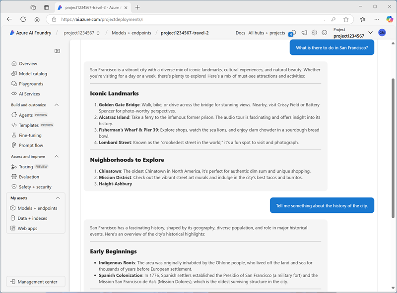

---
lab:
  title: Usare un prompt flow per gestire la conversazione in un'app di chat
  description: Informazioni su come usare i prompt flow per gestire i dialoghi di conversazione e assicurarsi che i prompt vengano sviluppati e orchestrati per ottenere risultati ottimali.
---

# Usare un prompt flow per gestire la conversazione in un'app di chat

In questo esercizio, verrà usato il prompt flow del Portale Fonderia Azure AI per creare un'app di chat personalizzata che impiega un prompt dell'utente e la cronologia della chat come input e usa un modello GPT di Azure OpenAI per generare un output.

Questo esercizio richiederà circa **30** minuti.

## Creare un progetto Fonderia Azure AI

Per iniziare, creare un progetto Fonderia Azure AI.

1. In un Web browser, aprire il [Portale Fonderia Azure AI](https://ai.azure.com) su `https://ai.azure.com` e accedere usando le credenziali di Azure. Chiudere i suggerimenti o i riquadri di avvio rapido aperti la prima volta che si accede e, se necessario, usare il logo **Fonderia Azure AI** in alto a sinistra per passare alla home page, simile all'immagine seguente:

    

1. Nella home page, selezionare **+ Crea progetto**.
1. Nella procedura guidata **Crea un progetto**, immettere un nome appropriato per il progetto. Se viene suggerito un hub esistente, selezionare l'opzione per crearne uno nuovo. Successivamente, esaminare le risorse Azure che verranno create automaticamente per supportare l'hub e il progetto.
1. Selezionare **Personalizza** e specificare le impostazioni seguenti per l'hub:
    - **Nome hub**: *un nome valido per l'hub*
    - **Sottoscrizione**: *la sottoscrizione di Azure usata*
    - **Gruppo di risorse**: *creare o selezionare un gruppo di risorse*
    - **Posizione**: selezionare **Informazioni su come scegliere** e quindi selezionare **gpt-4o** nella finestra Helper posizione e usare l'area consigliata\*
    - **Connettere Servizi di Azure AI o Azure OpenAI**: *Creare una nuova risorsa di Servizi di AI*
    - **Connettere Azure AI Search**: ignorare la connessione

    > \* Le risorse Azure OpenAI sono limitate da quote di modelli regionali. In caso di superamento di un limite di quota più avanti nell'esercizio, potrebbe essere necessario creare un'altra risorsa in un'area diversa.

1. Selezionare **Avanti** per esaminare la configurazione. Quindi selezionare **Crea** e attendere il completamento del processo.
1. Quando viene creato il progetto, chiudere tutti i suggerimenti visualizzati e rivedere la pagina del progetto nel portale Fonderia di Azure AI, che dovrebbe essere simile all'immagine seguente:

    

## Configurare l'autorizzazione delle risorse

Gli strumenti di prompt flow in Fonderia Azure AI creano asset basati su file che definiscono il prompt flow in una cartella di archiviazione BLOB. Prima di esplorare il prompt flow, verificare che la risorsa Servizi di Azure AI abbia l'accesso necessario all'archivio BLOB in modo che possa leggerli.

1. Nel riquadro di spostamento del portale Fonderia Azure AI, selezionare il **Centro di gestione** e visualizzare la pagina dei dettagli per il progetto, simile a questa immagine:

    

1. In **Gruppo di risorse**, selezionare il gruppo di risorse per aprirlo nella portale di Azure in una nuova scheda del browser; accedendo con le credenziali di Azure, se richiesto, e chiudendo eventuali notifiche di benvenuto per visualizzare la pagina del gruppo di risorse.

    Il gruppo di risorse contiene tutte le risorse di Azure per supportare l'hub e il progetto.

1. Selezionare la risorsa **Servizi di Azure AI** per l'hub per aprirla. Espandere quindi la sezione **In Gestione risorse** e selezionare la pagina **Identità**:

    

1. Se lo stato dell'identità assegnata dal sistema è **Disattivato**, cambiarlo in **Attivato** e salvare le modifiche. Attendere quindi che venga confermata la modifica dello stato.
1. Tornare alla pagina del gruppo di risorse e quindi selezionare la risorsa **account di archiviazione** per l'hub e visualizzarne la pagina **Controllo di accesso (IAM)**:

    

1. Aggiungere un'assegnazione di ruolo al`Storage blob data reader` ruolo per l'identità gestita usata dalla risorsa Servizi di Azure AI:

    

1. Dopo aver esaminato e assegnato l'accesso al ruolo per consentire all'identità gestita di Servizi di Azure AI di leggere i BLOB nell'account di archiviazione, chiudere la scheda del portale di Azure e tornare al portale Fonderia di Azure AI.
1. Nel riquadro di spostamento del portale Fonderia di Azure AI, selezionare **Vai al progetto** per tornare alla home page del progetto.

## Implementare un modello di IA generativa

A questo punto è possibile distribuire un modello linguistico di IA generativa per supportare l'applicazione del prompt flow.

1. Nel riquadro a sinistra del progetto, nella sezione **Risorse personali** selezionare la pagina **Modelli + endpoint**.
1. Nella scheda **Distribuzioni del modello** della pagina **Modelli + endpoint**, nel menu **+ Distribuisci modello** selezionare **Distribuisci modello di base**.
1. Cercare il modello **gpt-4o** nell'elenco e quindi selezionarlo e confermarlo.
1. Distribuire il modello con le impostazioni seguenti selezionando **Personalizza** nei dettagli della distribuzione:
    - **Nome distribuzione**: *nome univoco per la distribuzione del modello*
    - **Tipo di distribuzione**: standard globale
    - **Aggiornamento automatico della versione**: abilitato
    - **Versione del modello**: *selezionare la versione più recente disponibile*
    - **Risorsa di intelligenza artificiale connessa**: *selezionare la connessione alla risorsa Azure OpenAI*
    - **Token al limite di velocità al minuto (migliaia)**: 50.000 *(o il valore massimo disponibile nella sottoscrizione se inferiore a 50.000)*
    - **Filtro contenuto**: predefinitoV2

    > **Nota**: la riduzione del TPM consente di evitare l'eccessivo utilizzo della quota disponibile nella sottoscrizione in uso. 50.000 TPM dovrebbero essere sufficienti per i dati usati in questo esercizio. Se la quota disponibile è inferiore a questa, sarà possibile completare l'esercizio, ma potrebbero verificarsi errori se viene superato il limite di velocità.

1. Attendere il completamento della distribuzione.

## Creare un prompt flow

Un prompt flow consente di orchestrare le richieste e altre attività per definire un'interazione con un modello di IA generativa. In questo esercizio, verrà utilizzato un modello per creare un flusso di chat di base per un assistente di intelligenza artificiale in un'agenzia di viaggi.

1. Nella barra di spostamento del portale Fonderia Azure AI, nella sezione **Crea e personalizza**, selezionare **Prompt flow**.
1. Creare un nuovo flusso basato sul modello **flusso di chat**, specificando `Travel-Chat` come nome della cartella.

    Viene creato un flusso di chat semplice.

1. Per poter testare il flusso, è necessario calcolare e può essere necessario un po' di tempo per iniziare; selezionare quindi **Avvia sessione di calcolo** per iniziare durante l'esplorazione e la modifica del flusso predefinito.

1. Visualizzare il prompt flow, costituito da una serie di *input*, *output* e *strumenti*. È possibile espandere e modificare le proprietà di questi oggetti nei riquadri di modifica a sinistra e visualizzare il flusso complessivo come grafico a destra:

    

1. Visualizzare il riquadro **Input** e notare che sono presenti due input (cronologia chat e domanda dell'utente)
1. Visualizzare il riquadro **Output** e notare che è presente un output per riflettere la risposta del modello.
1. Visualizzare il riquadro degli strumenti LLM di **Chat**, che contiene le informazioni necessarie per inviare una richiesta al modello.
1. Nel riquadro degli strumenti LLM di **Chat**, per **Connessione**, selezionare la connessione per la risorsa del Servizio OpenAI di Azure nell'hub IA. Configurare quindi le seguenti proprietà di connessione:
    - **API**: chat
    - **deployment_name**: il *modello gpt-4o distribuito*
    - **response_format**: {"type":"text"}
1. Modificare il campo **Prompt** come indicato di seguito:

   ```yml
   # system:
   **Objective**: Assist users with travel-related inquiries, offering tips, advice, and recommendations as a knowledgeable travel agent.

   **Capabilities**:
   - Provide up-to-date travel information, including destinations, accommodations, transportation, and local attractions.
   - Offer personalized travel suggestions based on user preferences, budget, and travel dates.
   - Share tips on packing, safety, and navigating travel disruptions.
   - Help with itinerary planning, including optimal routes and must-see landmarks.
   - Answer common travel questions and provide solutions to potential travel issues.

   **Instructions**:
   1. Engage with the user in a friendly and professional manner, as a travel agent would.
   2. Use available resources to provide accurate and relevant travel information.
   3. Tailor responses to the user's specific travel needs and interests.
   4. Ensure recommendations are practical and consider the user's safety and comfort.
   5. Encourage the user to ask follow-up questions for further assistance.

   
   # user:
   {{item.inputs.question}}
   # assistant:
   {{item.outputs.answer}}
   

   # user:
   {{question}}
   ```

    Leggere il prompt aggiunto in modo da acquisire familiarità con esso. È costituito da un messaggio di sistema (che include un obiettivo, una definizione delle relative funzionalità e alcune istruzioni) e la cronologia della chat (ordinata per mostrare ogni input della domanda utente e output di risposta precedente dell'assistente)

1. Nella sezione **Input** per lo strumento LLM **Chat** (sotto il prompt) verificare che siano impostate le variabili seguenti:
    - **question** (stringa): ${inputs.question}
    - **chat_history** (stringa): ${inputs.chat_history}

1. Salvare le modifiche apportate al flusso.

    > **Nota**: in questo esercizio si userà un flusso di chat semplice, ma si noti che l'editor del prompt flow include molti altri strumenti che è possibile aggiungere al flusso, consentendo di creare una logica complessa per orchestrare le conversazioni.

## Testare il flusso

Dopo aver sviluppato il flusso, è possibile usare la finestra chat per testarlo.

1. Verificare che la sessione di calcolo sia in esecuzione. In caso contrario, attendere l'avvio.
1. Sulla barra degli strumenti, selezionare **Chat** per aprire il riquadro **Chat** e attendere che la chat venga inizializzata.
1. Immettere la query `I have one day in London, what should I do?` ed esaminare l'output. Il riquadro Chat deve essere simile al seguente:

    

## Distribuire il flusso

Quando si è soddisfatti del comportamento del flusso creato, è possibile distribuirlo.

> **Nota**: la distribuzione può richiedere molto tempo e può essere influenzata dai vincoli di capacità nella sottoscrizione o nel tenant.

1. Nella barra degli strumenti, selezionare **Distribuisci** e distribuire il flusso con le impostazioni seguenti:
    - **Impostazioni di base**:
        - **Endpoint**: Nuovo
        - **Nome endpoint**: *Immettere un nome univoco*
        - **Nome distribuzione**: *Immettere un nome univoco*
        - **Macchina virtuale**: Standard_DS3_v2
        - **Numero di istanze**: 1
        - **Raccolta di dati di inferenza**: Disabilitato
    - **Impostazioni avanzate**:
        - *Usa le impostazioni predefinite*
1. Nel portale Fonderia Azure AI, nel riquadro di navigazione, nella sezione **Asset personali**, selezionare la pagina **Modelli + endpoint**.

    Se la pagina viene aperta per il modello gpt-4o, usare il pulsante **Indietro** per visualizzare tutti i modelli e gli endpoint.

1. Inizialmente, la pagina può visualizzare solo le distribuzioni del modello. Potrebbe essere necessario del tempo prima che la distribuzione venga elencata e creata correttamente.
1. Al *termine* della distribuzione, selezionarla. Visualizzare quindi la relativa pagina **Test**.

    > **Suggerimento**: se la pagina di test descrive l'endpoint come non integro, tornare ai **modelli e agli endpoint** e attendere un minuto circa prima di aggiornare la visualizzazione e selezionare di nuovo l'endpoint.

1. Immettere il prompt `What is there to do in San Francisco?` e rivedere la risposta.
1. Immettere il prompt `Tell me something about the history of the city.` e rivedere la risposta.

    Il riquadro di test dovrebbe essere simile al seguente:

    

1. Visualizzare la pagina **Utilizzo** per l'endpoint e osservare che contiene informazioni di connessione e codice di esempio che è possibile usare per compilare un'applicazione client per l'endpoint, che consente di integrare la soluzione prompt flow in un'applicazione come IA generativa.

## Eseguire la pulizia

Quando si finisce di esplorare il prompt flow, è necessario eliminare le risorse create per evitare costi di Azure non necessari.

- Passare al [portale di Azure](https://portal.azure.com) all'indirizzo `https://portal.azure.com`.
- Nella **Home page** del portale di Azure selezionare **Gruppi di risorse**.
- Selezionare il gruppo di risorse creato per questo esercizio.
- Nel parte superiore della pagina **Panoramica** del gruppo di risorse selezionare **Elimina gruppo di risorse**.
- Immettere il nome del gruppo di risorse per confermare l'eliminazione e selezionare **Elimina**.
