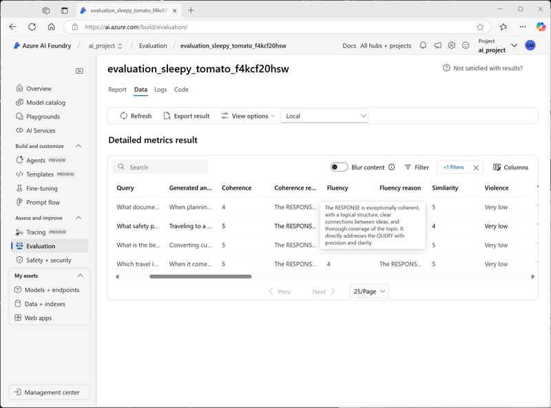

---
lab:
  title: Valutare le prestazioni del modello dell'IA generativa
  description: Informazioni su come valutare i modelli e le richieste per ottimizzare le prestazioni dell'app di chat e la sua capacità di rispondere in modo appropriato.
---

# Valutare le prestazioni del modello dell'IA generativa

In questo esercizio, verranno usate valutazioni manuali e automatizzate per valutare le prestazioni di un modello nel portale Fonderia Azure AI.

Questo esercizio richiederà circa **30** minuti.

> **Nota**: alcune delle tecnologie usate in questo esercizio sono in anteprima o in fase di sviluppo. È possibile che si verifichino alcuni comportamenti, avvisi o errori imprevisti.

## Creare un progetto Fonderia Azure AI

Per iniziare, creare un progetto Fonderia Azure AI.

1. In un Web browser, aprire il [Portale Fonderia Azure AI](https://ai.azure.com) su `https://ai.azure.com` e accedere usando le credenziali di Azure. Chiudere i suggerimenti o i riquadri di avvio rapido aperti la prima volta che è stato eseguito l'accesso e, se necessario, usare il logo **Fonderia Azure AI** in alto a sinistra per passare alla home page, simile all'immagine seguente (chiudere il riquadro **Aiuto** se è aperto):

    

1. Nella home page, selezionare **+ Crea progetto**.
1. Nella procedura guidata **Crea un progetto**, immettere un nome appropriato per il progetto. Se viene suggerito un hub esistente, selezionare l'opzione per crearne uno nuovo. Successivamente, esaminare le risorse Azure che verranno create automaticamente per supportare l'hub e il progetto.
1. Selezionare **Personalizza** e specificare le impostazioni seguenti per l'hub:
    - **Nome hub**: *un nome valido per l'hub*
    - **Sottoscrizione**: *la sottoscrizione di Azure usata*
    - **Gruppo di risorse**: *creare o selezionare un gruppo di risorse*
    - **Posizione**: selezionare una delle aree seguenti\*
        - Stati Uniti orientali 2
        - Francia centrale
        - Regno Unito meridionale
        - Svezia centrale
    - **Connettere Servizi di Azure AI o Azure OpenAI**: *Creare una nuova risorsa di Servizi di AI*
    - **Connettere Azure AI Search**: ignorare la connessione

    > \* Al momento della stesura di questo documento, queste aree supportano la valutazione delle metriche di sicurezza dell'IA. La disponibilità del modello è vincolata dalle quote a livello di area. In caso di raggiungimento di un limite di quota più avanti nell'esercizio, potrebbe essere necessario creare un altro progetto in un'area diversa.

1. Selezionare **Avanti** per esaminare la configurazione. Quindi selezionare **Crea** e attendere il completamento del processo.
1. Quando viene creato il progetto, chiudere tutti i suggerimenti visualizzati e rivedere la pagina del progetto nel portale Fonderia di Azure AI, che dovrebbe essere simile all'immagine seguente:

    

## Distribuire i modelli

In questo esercizio, verranno valutate le prestazioni di un modello gpt-4o-mini. Verrà usato anche un modello gpt-4o per generare metriche di valutazione assistita dall'intelligenza artificiale.

1. Nel riquadro di spostamento a sinistra del progetto, nella sezione **Asset personali** selezionare la pagina **Modelli + endpoint**.
1. Nella scheda **Distribuzioni del modello** della pagina **Modelli + endpoint**, nel menu **+ Distribuisci modello** selezionare **Distribuisci modello di base**.
1. Cercare il modello **gpt-4o** nell'elenco e quindi selezionarlo e confermarlo.
1. Distribuire il modello con le impostazioni seguenti selezionando **Personalizza** nei dettagli della distribuzione:
    - **Nome distribuzione**: *nome univoco per la distribuzione del modello*
    - **Tipo di distribuzione**: standard globale
    - **Aggiornamento automatico della versione**: abilitato
    - **Versione del modello**: *selezionare la versione più recente disponibile*
    - **Risorsa di intelligenza artificiale connessa**: *selezionare la connessione alla risorsa Azure OpenAI*
    - **Token al limite di velocità al minuto (migliaia)**: 50.000 *(o il valore massimo disponibile nella sottoscrizione se inferiore a 50.000)*
    - **Filtro contenuto**: predefinitoV2

    > **Nota**: la riduzione del TPM consente di evitare l'eccessivo utilizzo della quota disponibile nella sottoscrizione in uso. 50.000 TPM dovrebbero essere sufficienti per i dati usati in questo esercizio. Se la quota disponibile è inferiore a questa, sarà possibile completare l'esercizio, ma potrebbero verificarsi errori se viene superato il limite di velocità.

1. Attendere il completamento della distribuzione.
1. Tornare alla pagina **Modelli + endpoint** e ripetere i passaggi precedenti per distribuire un modello **gpt-4o-mini** con le stesse impostazioni.

## Valutare manualmente un modello

È possibile esaminare manualmente le risposte del modello in base ai dati dei test. L'esame manuale consente di testare input diversi per valutare se il modello funziona come previsto.

1. In una nuova scheda del browser, scaricare [travel_evaluation_data.csv](https://raw.githubusercontent.com/MicrosoftLearning/mslearn-ai-studio/refs/heads/main/data/travel_evaluation_data.csv) da `https://raw.githubusercontent.com/MicrosoftLearning/mslearn-ai-studio/refs/heads/main/data/travel_evaluation_data.csv` e salvarlo in una cartella locale.
1. Tornare alla scheda del portale di Fonderia Azure AI, nel riquadro di spostamento, nella sezione **Valutazione e miglioramento**, selezionare **Valutazione**.
1. Nella pagina **Valutazione**, visualizzare la scheda **Valutazioni manuali** e selezionare **+ Nuova valutazione manuale**.
1. Modificare il **messaggio di sistema** con le istruzioni seguenti per un assistente viaggio di intelligenza artificiale:

   ```
   Objective: Assist users with travel-related inquiries, offering tips, advice, and recommendations as a knowledgeable travel agent.

   Capabilities:
   - Provide up-to-date travel information, including destinations, accommodations, transportation, and local attractions.
   - Offer personalized travel suggestions based on user preferences, budget, and travel dates.
   - Share tips on packing, safety, and navigating travel disruptions.
   - Help with itinerary planning, including optimal routes and must-see landmarks.
   - Answer common travel questions and provide solutions to potential travel issues.
    
   Instructions:
   1. Engage with the user in a friendly and professional manner, as a travel agent would.
   2. Use available resources to provide accurate and relevant travel information.
   3. Tailor responses to the user's specific travel needs and interests.
   4. Ensure recommendations are practical and consider the user's safety and comfort.
   5. Encourage the user to ask follow-up questions for further assistance.
   ```

1. Nella sezione **Configurazioni**, selezionare la distribuzione del modello **gpt-4o-mini** nell'elenco **Modello**.
1. Nella sezione **Risultato della valutazione manuale** selezionare **Importa dati di test** e caricare il file **travel_evaluation_data.csv** scaricato in precedenza. Eseguire il mapping dei campi del set di dati come indicato di seguito:
    - **Input**: domanda
    - **Risposta prevista**: ExpectedResponse
1. Esaminare le domande e le risposte previste nel file di test: verranno usate per valutare le risposte generate dal modello.
1. Selezionare **Esegui** dalla barra superiore per generare output per tutte le domande aggiunte come input. Dopo alcuni minuti, le risposte del modello devono essere visualizzate in una nuova colonna **Output**, come illustrato di seguito:

    

1. Esaminare gli output per ogni domanda, confrontando l'output del modello con la risposta prevista e "assegnando dei punteggi" ai risultati selezionando l'icona pollice verso l'alto o verso il basso in basso a destra di ogni risposta.
1. Dopo aver ottenuto il punteggio delle risposte, esaminare i riquadri di riepilogo sopra l'elenco. Nella barra degli strumenti, selezionare **Salva risultati** e assegnare un nome appropriato. Il salvataggio dei risultati consente di recuperarli in un secondo momento per un'ulteriore valutazione o un confronto con un modello diverso.

## Usare valutazioni automatizzate

Mentre il confronto manuale dell'output del modello con le risposte previste può essere un modo utile per valutare le prestazioni di un modello, è un approccio dispendioso in termini di tempo in scenari in cui è attesa un'ampia gamma di domande e risposte; e fornisce poco nel modo delle metriche standardizzate che è possibile usare per confrontare diverse combinazioni di modelli e prompt.

La valutazione automatizzata è un approccio che tenta di risolvere queste carenze calcolando le metriche e usando l'IA per valutare le risposte per coerenza, pertinenza e altri fattori.

1. Usare la freccia indietro (**&larr;**) accanto al titolo pagina **Valutazione manuale** per tornare alla pagina **Valutazione**.
1. Visualizzare la scheda **Valutazioni automatiche**.
1. Selezionare **Crea una nuova valutazione** e, quando richiesto, selezionare l'opzione per valutare un **modello e prompt**
1. Nella pagina **Crea una nuova valutazione**, nella sezione **Informazioni di base**, esaminare il nome di valutazione predefinito generato automaticamente (è possibile modificarlo) e selezionare la distribuzione del modello **gpt-40-mini**.
1. Modificare il **messaggio di sistema** con le stesse istruzioni per un assistente viaggio di intelligenza artificiale usate in precedenza:

   ```
   Objective: Assist users with travel-related inquiries, offering tips, advice, and recommendations as a knowledgeable travel agent.

   Capabilities:
   - Provide up-to-date travel information, including destinations, accommodations, transportation, and local attractions.
   - Offer personalized travel suggestions based on user preferences, budget, and travel dates.
   - Share tips on packing, safety, and navigating travel disruptions.
   - Help with itinerary planning, including optimal routes and must-see landmarks.
   - Answer common travel questions and provide solutions to potential travel issues.
    
   Instructions:
   1. Engage with the user in a friendly and professional manner, as a travel agent would.
   2. Use available resources to provide accurate and relevant travel information.
   3. Tailor responses to the user's specific travel needs and interests.
   4. Ensure recommendations are practical and consider the user's safety and comfort.
   5. Encourage the user to ask follow-up questions for further assistance.
   ```

1. Nella sezione **Configura dati di test**, è possibile usare un modello GPT per generare automaticamente i dati di test (che è quindi possibile modificare e integrare per soddisfare le proprie aspettative), usare un set di dati esistente o caricare un file. In questo esercizio, selezionare **Usa set di dati esistente** e quindi selezionare il set di dati **travel_evaluation_data_csv_*xxxx...*** (creato al momento del caricamento del file .csv in precedenza).
1. Esaminare le righe di esempio del set di dati e quindi nella sezione **Scegliere la colonna di dati** selezionare i mapping di colonna seguenti:
    - **Query**: domanda
    - **Contesto**: *lasciare vuoto questo campo. Viene usato per valutare l'"allineamento" quando si associa un'origine dati contestuale al modello.*
    - **Verità di base**: ExpectedAnswer
1. Nella sezione **Scegliere cosa valutare** selezionare <u>tutte</u> le categorie di valutazione seguenti:
    - Qualità dell'IA (basata sull'IA)
    - Rischio e sicurezza (basati sull'IA)
    - Qualità dell'intelligenza artificiale (NLP)
1. Nell'elenco **Scegliere una distribuzione del modello come giudice** selezionare il modello **gpt-4o**. Questo modello verrà usato per valutare le risposte del modello ***gpt-4o-mini** per la qualità correlata al linguaggio e le metriche di confronto di IA generativa standard.
1. Selezionare **Crea** per avviare il processo di valutazione e attenderne il completamento. L'operazione potrebbe richiedere alcuni minuti.

    > **Suggerimento**: se viene visualizzato un errore che mostra che le autorizzazioni del progetto sono state impostate, attendere un minuto e quindi selezionare di nuovo **Crea**. Le autorizzazioni delle risorse possono richiedere del tempo prima della propagazione di un progetto appena creato.

1. Al termine della valutazione, scorrere verso il basso, se necessario, per visualizzare l'area **Dashboard delle metriche** e visualizzare le metriche di **qualità dell'intelligenza artificiale (basata sull'IA)**:

    

    Usare le icone **<sup>(i) </sup>** per visualizzare le definizioni delle metriche.

1. Visualizzare la scheda **Rischio e sicurezza** per visualizzare le metriche associate a contenuti potenzialmente dannosi.
1. Visualizzare la scheda **Qualità intelligenza artificiale (NLP**) per visualizzare le metriche standard per i modelli di IA generativa.
1. Scorrere di nuovo verso la parte superiore della pagina, se necessario, e selezionare la scheda **Dati** per visualizzare i dati non elaborati dalla valutazione. I dati includono le metriche per ogni input e le spiegazioni del ragionamento che il modello gpt-4o ha applicato durante la valutazione delle risposte.

    

## Eseguire la pulizia

Al termine dell'esplorazione di Azure AI Foundry, è necessario eliminare le risorse create per evitare costi di Azure non necessari.

- Passare al [portale di Azure](https://portal.azure.com) all'indirizzo `https://portal.azure.com`.
- Nella **Home page** del portale di Azure selezionare **Gruppi di risorse**.
- Selezionare il gruppo di risorse creato per questo esercizio.
- Nel parte superiore della pagina **Panoramica** del gruppo di risorse selezionare **Elimina gruppo di risorse**.
- Immettere il nome del gruppo di risorse per confermare l'eliminazione e selezionare **Elimina**.
